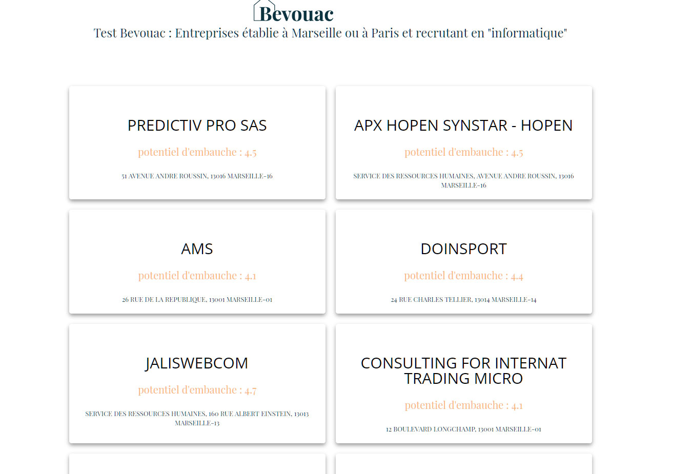

# bevouac

## Site

```javascript
Accès

// http://localhost:8080/ ou http://192.168.1.16:8080/ -> 
```

:bulb: **Développé avec : vuejs, html5, css3, sass, pwa** 

## Table des matières

- [Install](#install)
- [API](#api)
- [Rendu](#rendu)
- [Vérifications](#verifications)
- [License](#license)

## Install

Installer NodeJs en allant sur le site https://nodejs.org/en/ et en le téléchargeant.
Lancer git bash
Ecrire les lignes suivantes : 

```javascript
$ npm install -g @vue/cli
$ vue create bevouac // En Vue.js
$ cd bevouac
$ npm install axios // Appel d'API avec vue.js
$ curl -X POST https://entreprise.pole-emploi.fr/connexion/oauth2/access_token?realm=%2Fpartenaire -d "grant_type=client_credentials&client_id=PAR_testbevouac_aa9afbdc5775a3095e1db0269e82d46abb7911e08956fec04e02fdb699a7aaa0&client_secret=346fb216d17c0f15099e7998d36369d49fb6dbbcb2afa165220e71c6bc4c13e7&scope=application_PAR_testbevouac_aa9afbdc5775a3095e1db0269e82d46abb7911e08956fec04e02fdb699a7aaa0%20api_labonneboitev1"
$ npm install --save-dev sass sass-loader // Install pour Sass
$ npm install -g sass
$ cd src/assets/sass
$ sass  --watch app.scss:app.css --style compressed // creation du .css et compression
$ cd ../../
$ npm run serve

## API

https://pole-emploi.io/data/api/bonne-boite
Les ressources exposées permettant de : 
Récupérer la liste des entreprises classées par potentiel d embauche pour un métier (code ROME)

Identifiant : PAR_testbevouac_aa9afbdc5775a3095e1db0269e82d46abb7911e08956fec04e02fdb699a7aaa0
Clé : 346fb216d17c0f15099e7998d36369d49fb6dbbcb2afa165220e71c6bc4c13e7

API : https://api.emploi-store.fr/partenaire/labonneboite/v1/company/

accès Token : https://pole-emploi.io/data/documentation/utilisation-api-pole-emploi/generer-access-token

Exemple : https://labonneboite.pole-emploi.fr/

### Rendu


[]


### Vérifications

- **La page est responsive, fonctionne sur Chrome, Firefox, Edge.**:
- **Le score au niveau des indicateurs de chrome lighthouse : Performances non optimisées - 100% en accessibilité - 87% en Best Practice - 100% en SEO - PWA**: 
- **Validation W3C : https://validator.w3.org/#validate_by_upload : validé**: 
- **Vérification chargement page : https://search.google.com/test/mobile-friendly/ : Page adaptée aux mobiles**:

## License

The MIT License (MIT)

Copyright (c) 2021 Cécile

### Customize configuration
See [Configuration Reference](https://cli.vuejs.org/config/).
